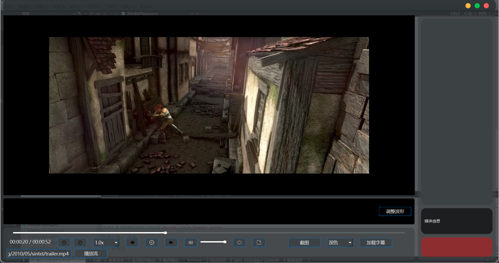

Qt 媒体播放器
基于 Qt 和 FFmpeg 构建的跨平台媒体播放器，支持视频和音频的正常播放、倒放、字幕加载、波形图显示以及流媒体播放。播放器采用现代无边框界面设计，支持主题切换和直观的操作控制。
功能:
媒体播放：支持多种格式的视频和音频文件（MP4、AVI、MKV、MP3、WAV 等），提供播放、暂停、停止、快进/快退和音量调节功能。
倒放功能：通过 FFmpeg 实现视频逆向播放，支持倒放进度控制和暂停。
音频波形：实时显示音频波形图，使用 OpenGL 渲染。
字幕支持：加载并显示 SRT 格式字幕，与播放进度同步。
播放列表与历史：管理播放列表，支持拖放添加文件、排序和查看最近播放历史。
流媒体：通过 URL 播放在线媒体流。
自定义界面：无边框窗口，支持深色/浅色主题切换、可调整波形高度和截图功能。
快捷键：空格键播放/暂停，左右箭头键快进/快退等，提升操作效率。
错误提示：提供友好的错误提示，5 秒后自动清除。

安装
前提条件

Qt:6.7.3
FFmpeg：版本 4.x 或更高（需包含开发库）
OpenGL：系统需支持
编译器：支持 C++17 的 GCC、MSVC 或 Clang
CMake：用于构建项目（可选）

确保 FFmpeg 库正确链接（必要时更新 .pro 或 CMakeLists.txt 中的 FFmpeg 路径）。
使用方法

打开文件：点击“添加文件”按钮或将媒体文件拖放到窗口中。
控制播放：
播放/暂停：空格键或播放/暂停按钮。
跳转：使用进度条或左右箭头键（±5 秒）。
音量：通过音量滑块调节或点击静音按钮。

倒放模式：切换到倒放模式（需在界面实现）以逆向播放视频。
波形图：查看音频波形，通过波形调整按钮切换高度。
字幕：通过“加载字幕”按钮导入 SRT 文件。
流媒体：输入有效的流媒体 URL，点击“播放流”。
截图：点击截图按钮捕获当前帧（保存至用户主目录）。
主题：通过主题下拉框切换深色/浅色模式。
播放列表：添加多个文件，支持排序和通过上下按钮切换。

项目结构

mainwindow.cpp/h：主窗口逻辑和界面管理。
videowidget.cpp/h：自定义视频播放控件。
VideoSlider.cpp/h：自定义进度条控件。
VideoFrameDisplay.cpp/h：视频帧显示控件。
utils.cpp/h：工具函数，处理文件操作和媒体信息。
seekFrame.cpp/h：视频帧定位功能。
reversedecode.cpp/h：视频逆向解码。
reversedisplay.cpp/h：倒放帧显示。
getaudio.cpp/h：音频数据提取。
audioimage.cpp/h：音频波形图显示。
